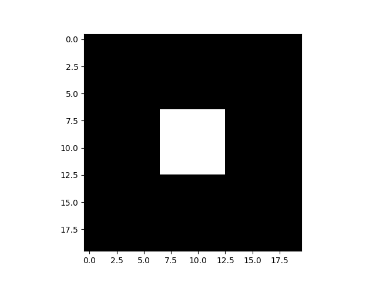
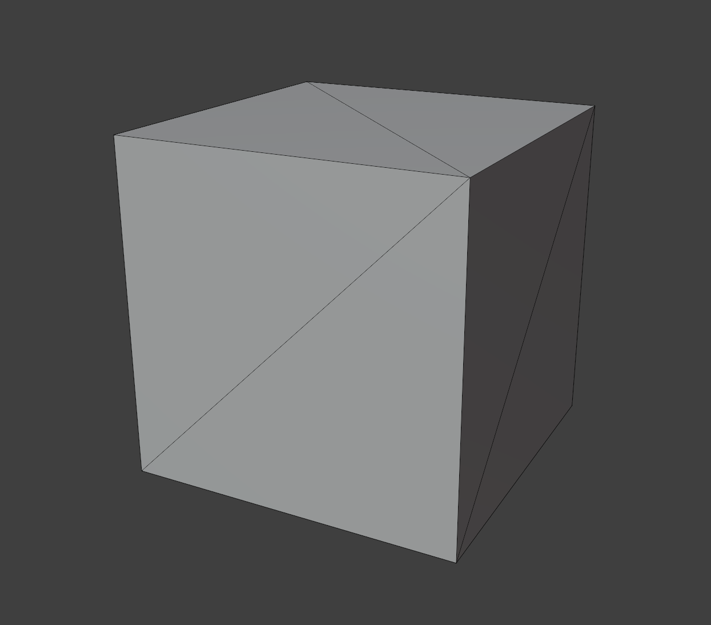
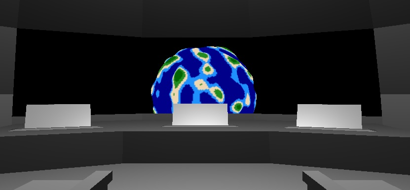

# Assignment 5

In the fifth (and final) assignment, we will take the 3D simulation a step further: we will create a simulation of a spaceship, a planet and stars.

## Table of Contents
- [Task 1: Creating a bare planet](#1-creating-a-planet)
- [Task 2: Procedural generation: creating an interesting planet](#2-interesting-planet)
- [Task 3: Integrating with the space simulation](#3-space-simulation)
- [Task 5: (optional) User interface](#5-interface)


### 1. Creating the Planet
Before we create the planet, let's walkthrough some prerequisites. Until this point, we have abstracted several graphics concepts in the `lib` package, e.g. 3D shapes with the `Prism3D` and `Line3D`, and the camera. As we will create a planet that *you* can configure and make unique, it is useful to have some insight in how the graphics processor manages 3D models.

When we work in 2D, we can specify the colours of individual pixels. For example, consider the following image:

```py
import matplotlib.pyplot as plt
import numpy as np

# Create a square in the image centre
img = np.zeros((20, 20))
img[7:13, 7:13] = 1.0
plt.imshow(img, cmap="grey")
plt.show()
```



Doing this with 3D graphics would not only be tedious; it would be very slow. Instead, we can use the graphics processor as a leverage and pass the vertices we want to draw.

```py
# Vertex positions in Normalised Device Coordinates (NDC) for a cube. Typically,
# it ranges from -1 to 1.
vertices = [
    # "Front facing" vertices
    (-0.5, -0.5, -0.5), # Vertex 0
    ( 0.5, -0.5, -0.5), # Vertex 1
    ( 0.5,  0.5, -0.5), # Vertex 2
    (-0.5,  0.5, -0.5), # Vertex 3

    # "Back facing" vertices
    (-0.5, -0.5, -0.5), # Vertex 4
    ( 0.5, -0.5, -0.5), # Vertex 5
    ( 0.5,  0.5, -0.5), # Vertex 6
    (-0.5,  0.5, -0.5)  # Vertex 7
]

upload_vertices_to_gpu(vertices)
```

(If you're curious; this is how we created `Prism3D` in assignment 3).

There is one detail we missed... (almost) all geometries are draw with triangles. This is useful, because we can represent all kinds of shapes with only triangles. This means we need to modify the `vertices` list, so each side of a cube is a square of two triangles:

```py3
vertices = [
    # Front
    (-0.5, -0.5, -0.5), # Vertex 0
    ( 0.5, -0.5, -0.5), # Vertex 1
    ( 0.5,  0.5, -0.5), # Vertex 2

    ( 0.5,  0.5, -0.5), # Vertex 2
    (-0.5,  0.5, -0.5), # Vertex 3
    (-0.5, -0.5, -0.5), # Vertex 0

    # Back
    (-0.5, -0.5, -0.5), # Vertex 4
    ( 0.5, -0.5, -0.5), # Vertex 5
    ( 0.5,  0.5, -0.5), # Vertex 6

    ( 0.5,  0.5, -0.5), # Vertex 6
    (-0.5,  0.5, -0.5), # Vertex 7
    (-0.5, -0.5, -0.5), # Vertex 4

    # Right
    ( 0.5, -0.5, -0.5), # Vertex 1
    ( 0.5, -0.5, -0.5), # Vertex 5
    ( 0.5,  0.5, -0.5), # Vertex 6

    ( 0.5,  0.5, -0.5), # Vertex 6
    ( 0.5,  0.5, -0.5), # Vertex 2
    ( 0.5, -0.5, -0.5), # Vertex 1

    # Left
    # ...

    # Top
    # ...
    
    # Bottom
    # ...
]
```



Simply by observing the vertex indices with the inline comments, it is evident that vertices are duplicated. The greater the number of vertices, the more memory the program needs to store this geometry. The solution which the industry has adapted is to use vertex indices (commonly known as an index buffer or an element buffer). Using the index buffer, we can list all the vertices that exist in a geometry and exclude duplicated vertices, and use indices to define the vertices that make the triangles.

Example for a square:
```py
# A triangle with indices
#
# 3   2
# |---|
# |  /|
# | / |
# |---|
# 0   1
vertices = [
    (-0.5, -0.5, -0.5), # Vertex 0
    ( 0.5, -0.5, -0.5), # Vertex 1
    ( 0.5,  0.5, -0.5), # Vertex 2
    (-0.5,  0.5, -0.5)  # Vertex 3
]

indices = [
    0, 1, 2, # First triangle
    2, 3, 0  # Second triangle
]
```

---

In our simulation, the planet is a [geodesic polyhedron](https://en.wikipedia.org/wiki/Geodesic_polyhedron). This is also known as an icosphere. We will use the library `vedranaa/icosphere`, which provides code to generate the icosphere. We will first construct the parameters for the icosphere.

a) Set the subdivision frequency for the icosphere. Example:
```py
subdivision_frequency = 60
```

b) Create the vertices and indices:
```py
vertices, indices = icosphere(subdivision_frequency)
indices = indices.flatten().tolist()
vertices = vertices.flatten().tolist()
count = vertices.shape[0]
```

c) Instantiate the planet
```py
# We need the number of vertices so the Planet class can internally allocate
# memory based on some input noise (more about this in task 4)
planet = lib.shapes.Planet(
    # The planet's position in space
    x, y, z,

    # Vertex attributes
    vertices=vertices,
    indices=indices,
    count=num_of_vertices,

    # Noise. This is only used for colouring the planet. It is expected
    # to be a list of noise values per vertex.
    noise=None

    # Other (optional, but recommended)
    batch=batch
)
```

<!-- The number of vertices are defined as follow:

$$c = 10 * \lambda^2 + 2$$

where $c$ is the number of vertices, and $\lambda$ is the subdivision frequency. -->

By default, the planet is completely white. That means if everything was configured correctly, you should see a white planet in front of the camera.

### 2. Procedural generation

We will use noise / procedural generation to make the planet more interesting in two ways:
1. Deform the planet to create mountain landscape.
2. Colour the planet.

a) Firstly, note that to implement Perlin noise we are required to interpolate inside of a (cubic) grid. This is accomplished with [Trilinear interpolation](https://en.wikipedia.org/wiki/Trilinear_interpolation). Let's write interpolating tools into our library, i.e. in [lib/linalg.py](./lib/linalg.py) implement:
- a (l)inear int(erp)olation function `lerp(a, b, t)`.
- a trilinear interpolation function on a 3d grid. You can choose how to do this, but it should be built up from the lerp function.

b) In [lib/noise.py](./lib/noise.py), implement function `_perlin_noise3(...)`.
- The function takes a 3d position as input and computes the noise value for that particular position.

c) Implement the function `perlin(...)` that uses `_perlin_noise3(...)` to produce fractal noise, or Fractal Brownian Motion. This is built on top of the Perlin noise. It has three additional parameters: 'octaves', 'lacunarity', and 'persistence' (or 'gain'). These will be explained in the lectures. 


At the end of [lib/noise.py](./lib/noise.py), some code is provided to visualise the noise output. This can be executed with the following command:
```
python -m lib.noise
```

d) Use the new noise functions to generate noise on the planet.
- Modify your code from *1c* so the vertices are displaced by the noise.
- On instantiating the planet, the noise parameter is a list of noise values for each vertex. This is used only for colouring.
- To change the planet's colours, adjust the thresholds and colours in *lib/shape.py* in function `height_to_color()`.

### 3. Integrate with the spaceship

Now you can create planets, it is up to you to include them in your space simulation. You are free to do so as you wish!

Ideally you should be able to control the spaceship so that it can move through space.



### (Optional) 4. Add more planets
To make the program more interesting, add several plants of different size and parameters.

### (Optional) 5. User Interface
A useful feature to develop programs like this is the introduction of widgets. These are user interfaces that let us e.g. quickly changing parameters without recompiling code. In our own test program, we wrote some sliders that help us deciding which parameters make the planet look the best:


The code to create sliders reside in [lib/widgets.py](./lib/widgets.py).

Example code:
```py
from pyglet.window import key, mouse
import pyglet

# Initialisation
# --------------

# Usually, widgets should belong to their own batch to not.
widget_batch = pyglet.graphics.Batch()
window = pyglet.window.Window()

# Widgets tend to use their own projection and view matrices, so they don't
# move with the camera.
widget_projection = window.projection
widget_view = window.view

# Initialise the font
font_size = 18
font_type = "Times New Roman"

# Create a slider widget
slider = lib.widgets.Slider(
    # Position
    x=150, y=200,
    
    # Background size (the part that covers the length of the slider)
    width=300, height=20,

    # Knob size (the part that you click to move the slider)
    knob_width=60, knob_height=40,

    # Colours
    color=(249, 166, 253, 255),
    knob_color=(90, 90, 90, 255),

    batch=batch,

    # Value range: [0, 1].
    starting_value=0.0
)


# To create a label, use Pyglet's built-in Label widget
label = pyglet.text.Label("My label",
    # Font attributes
    font_name=font_type, font_size=font_size,

    # Position
    x=60, y=35, anchor_x="left", anchor_y="center",
    batch=batch
)

# Updating
# --------
def on_mouse_drag(self, x, y, dx, dy, buttons, modifiers):
    # Update the slider and lable on mouse drag
    if mouse.LEFT:
        slider.update_clicked(x, y)
        label.text = str(slider.value)

# Drawing
# -------
@window.event
def on_draw():
    # Draw objects as per usual
    window.projection = camera.get_projection()
    window.view = camera.get_look_at()
    batch.draw()

    # Draw widgets. We clear the projection and view matrices before drawing
    # them.
    window.projection = window_projection
    window.view = window_view
    widgets_batch.draw()
```
